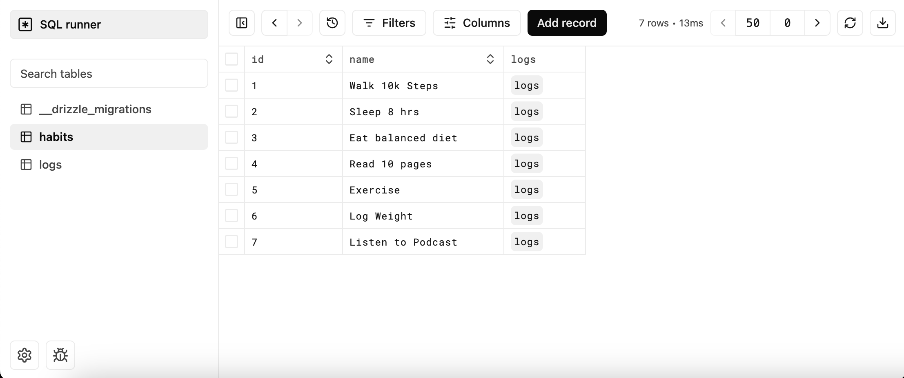

In an effort to gain a better understanding of local-first architecture, I decided to build a simple habit tracking app. The app is designed to allow users to easily add and remove daily habits they wish to track, along with the ability to check them off each day. Such an application is particularly well-suited for a local-first approach, as it primarily relies on data storage directly on the user's device.

In this article, we'll walk through how to set up and build a local-first habit tracking app using Expo, Expo SQLite, Drizzle and Drizzle Kit.

## The Tech Stack

#### Expo and Expo Router

[Expo](https://expo.dev/) is a powerful framework for building cross-platform React Native applications. It simplifies the development process and provides a rich set of tools and libraries.

#### Expo SQLite

[Expo SQLite](https://docs.expo.dev/versions/latest/sdk/sqlite/) is a library that allows you to access a SQLite database, enabling you to store data locally on the device. This is crucial for local-first applications, as it ensures that users can access their data anytime.

#### Drizzle

[Drizzle](https://orm.drizzle.team/docs/overview) is a TypeScript ORM for SQL databases that simplifies database interactions. It provides a clean and intuitive API for querying and manipulating data.

#### Drizzle Kit

[Drizzle Kit](https://orm.drizzle.team/docs/kit-overview) is a CLI tool for managing database migrations, making it easier to evolve your database schema over time.

## Initialization

### Create the project

To get started, we will create a new Expo project using the tabs template, which provides a basic structure for our app.

```bash
npx create-expo-app --template tabs
```

### Install dependencies

Next, we need to install the necessary dependencies: Expo SQLite, Drizzle, Drizzle Kit, and a Babel inline-import plugin.

```bash
npx expo install expo-sqlite
npm i drizzle-orm
npm i -D drizzle-kit babel-plugin-inline-import
```

## Configuration

### Configure `metro.config.js`

Metro requires all extensions for source code to be explicitly defined before starting the bundler. Since drizzle-kit migrations generate .sql files, we will need to initialize a `metro.config.js` file and add `sql` as a source extension.

Create a `metro.config.js` file in root folder of your project:

```bash
npx expo customize metro.config.js
```

Then, update `metro.config.js` to add `sql` as a source extension :

```ts
// Learn more https://docs.expo.io/guides/customizing-metro
const { getDefaultConfig } = require("expo/metro-config");

/** @type {import('expo/metro-config').MetroConfig} */
const config = getDefaultConfig(__dirname);
config.resolver.sourceExts.push("sql"); // <-- add this line

module.exports = config;
```

### Update `babel.config.js`

Next, we need to update the `babel.config.js` file to allow importing `.sql` files into our code:

```js
module.exports = function (api) {
  api.cache(true);
  return {
    presets: ["babel-preset-expo"],
    plugins: [
      ...,
      ["inline-import", { extensions: [".sql"] }], // <-- add this line
    ],
  };
};
```

Skipping this step will cause the following error when applying migrations on app startup:

```
Missing semicolon. (1:6)

> 1 | CREATE TABLE `habits` (
    |       ^
  2 |   `id` integer PRIMARY KEY AUTOINCREMENT NOT NULL,
  3 |   `name` text NOT NULL
  4 | );

```

## Setup

Create a `db` folder under project root to contain `client.ts` and `schema.ts` files:

```
📦 <project root>
 ├ 📂 db
    └ 📜 client.ts
    └ 📜 schema.ts
```

### Define the database schema

In the `schema.ts` file, define the structure of your database tables:

```ts
import { int, sqliteTable, text } from "drizzle-orm/sqlite-core";

export const habits = sqliteTable("habits", {
  id: int().primaryKey({ autoIncrement: true }),
  name: text().notNull(),
  created_at: text(),
});

export type Habit = typeof habits.$inferSelect;
```

### Configure the database client

In the `client.ts` file, initialize the connection to the SQLite database:

```ts
import { drizzle } from "drizzle-orm/expo-sqlite";
import { openDatabaseSync } from "expo-sqlite";
import * as schema from "./schema";

export const DATABASE_NAME = "database.db";

export const expo_sqlite = openDatabaseSync(DATABASE_NAME);
export const db = drizzle(expo_sqlite, { schema });
```

### Configure Drizzle Kit

Create a `drizzle.config.ts` file in the root of your project to configure Drizzle Kit:

```ts
import { defineConfig } from "drizzle-kit";

export default defineConfig({
  dialect: "sqlite",
  driver: "expo",
  schema: "./db/schema.ts",
  out: "./drizzle",
});
```

### Generate migrations

To generate the SQL migration files based on the database schema specified in the `drizzle.config.js` file, run:

```bash
npx drizzle-kit generate
```

This will generate a `.sql` file and create a `migrations.js` file under the `drizzle` folder.

```
📦 <project root>
 ├ 📂 drizzle
    └ 📜 0000_black_panther.sql
    └ 📜 migrations.js
```

## Usage

Before accessing the database, we will need to apply the migrations to the database.

### Run migrations on startup

In the `app/_layout.tsx` file, modify the `RootLayout` to run migrations on application startup with the `useMigrations` hook:

```tsx
// Add these imports
import { useMigrations } from "drizzle-orm/expo-sqlite/migrator";
import { db } from "@/db";
import migrations from "@/drizzle/migrations";

export default function RootLayout() {
  const [loaded, error] = useFonts({
    SpaceMono: require("../assets/fonts/SpaceMono-Regular.ttf"),
    ...FontAwesome.font,
  });

  const { success, error: migrationError } = useMigrations(db, migrations);

  useEffect(() => {
    if (error) throw error;
    if (migrationError) throw migrationError;
  }, [error, migrationError]);

  useEffect(() => {
    if (loaded && success) {
      SplashScreen.hideAsync();
    }
  }, [loaded, success]);

  if (!loaded && !success) {
    return null;
  }

  return <RootLayoutNav />;
}
```

### Accessing data

#### Reading data

Drizzle provides several ways of querying your data. You can use `select` or `query` syntax for data fetching.

- **Select Syntax**: Drizzle's query builder is the most SQL-like way to fetch data from your database, while remaining type-safe. It can also be used with the `useLiveQuery` hook for live updates. For example, to fetch all users from the database can be written as:

```ts
const allHabits = await db.select().from(habits);
```

- **Query Syntax**: [Drizzle Queries](https://orm.drizzle.team/docs/rqb) are an extension to your schema definition and the query builder and are useful for simple data fetching. For example, to same query to fetch all habits from the database can be written as:

```ts
const allHabits = await db.query.habits.findMany();
```

To use the `db.query` syntax and enable intellisense in the text editor, we need to provide all tables and relations by [passing the `schema` during drizzle() initialization](https://orm.drizzle.team/docs/rqb#querying) as shown in the [Configure the database client](#configure-the-database-client) section.

#### Live Queries

To make Drizzle queries reactive to changes in the database you can use the `useLiveQuery` hook. To use it, we need to make sure to set `enableChangeListener` to true when initializing the SQLite database:

```
openDatabaseSync(DATABASE_NAME, { enableChangeListener: true});
```

```ts
const getHabits = () => {
  return db.select().from(habits);
};

const allHabits = useLiveQuery(getHabits());
```

#### Inserting data

To insert data into your database, you can use the [`insert`](https://orm.drizzle.team/docs/insert) method. For example, to add a new habit:

```ts
await db.insert(habits).values({
  name: "Read 10 pages",
});
```

If you need insert type for a particular table you can use `typeof habitsTable.$inferInsert` syntax.

```ts
type NewHabit = typeof habits.$inferInsert;

const insertHabit = async (habit: NewHabit) => {
  return db.insert(habits).values(habit);
};

const newHabit: NewHabit = { name: "Read 10 pages" };
await insertHabit(newHabit);
```

#### Updating data

To update existing data, use the [`update`](https://orm.drizzle.team/docs/update) method. For example, to update a habit's name:

```ts
await db.update(habits).set({ name: "Read 20 pages" }).where(eq(habits.id, 1));
```

#### Deleting data

To delete data from your database, use the [`delete`](https://orm.drizzle.team/docs/delete) method. For example, to delete a habit by its ID:

```ts
await db.delete(habits).where(eq(habits.id, 1));
```

#### Advanced Querying

For more advanced queries refer to the **Access Your Data** section of the [Drizzle documentation](https://orm.drizzle.team/docs/).

## Drizzle Studio for Expo SQLite

[Drizzle Studio for Expo SQLite](https://github.com/drizzle-team/drizzle-studio-expo) is handy Expo dev tools plugin that allows you to browse your Expo SQLite data with Drizzle Studio.

### Install plugin

To use it, you'll first need to install the plugin:

```bash
npm i expo-drizzle-studio-plugin
```

### Setup plugin

Once installed, setup the plugin with the `useDrizzleStudio` hook:

```tsx
import { useDrizzleStudio } from "expo-drizzle-studio-plugin";
import { openDatabaseSync } from "expo-sqlite";
import { View } from "react-native";

const db = openDatabaseSync("db");

export default function App() {
  useDrizzleStudio(db);

  return <View></View>;
}
```

### Launch plugin

Start the Expo project and run the app on Android or iOS simulator or a physical device:

```bash
npx expo start
```

In the Terminal, type `Shift + M` to bring up the Dev tools menu, then use the arrow keys to select **Open expo-drizzle-studio-plugin**
to launch the plugin in your browser.

```
? Dev tools (native only) › - Use arrow-keys. Return to submit.
    Inspect elements
    Toggle performance monitor
    Toggle developer menu
    Reload app
    Open React devtoolsa
❯   Open expo-drizzle-studio-plugin
```

This will allow you to browse, add, delete, and update data in your SQLite database based on your existing Drizzle SQL schema.



---

For the complete source code, you can view the repository at [https://github.com/israataha/expo-sqlite-drizzle](https://github.com/israataha/expo-sqlite-drizzle).
