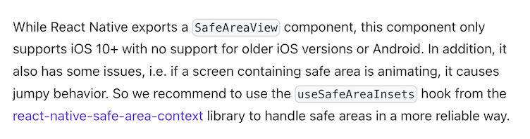

While testing a React Native app on iOS recently, I noticed that every time I selected a new tab, the text on the screen would "jump" while rendering. Oddly enough, I wasn't seeing the same behavior on an emulator.

A quick search lead me to this [article](https://echobind.com/post/react-native-fix-jumping-screens-in-the-react-navigation-tabnavigator) which described exactly the problem I was seeing. Even though it was a few years old and referenced version 1.x of React Navigation, it pointed at a potential culprit; the usage of the SafeAreaView component.

So I went back to the [React Navigation](https://reactnavigation.org/) docs and a quick search lead me to the guide on [Supporting safe areas](https://reactnavigation.org/docs/handling-safe-area).

Reading through, this section immediately jumped out at me:


> if a screen containing safe area is animating, it causes jumpy behavior.

Bingo! I found the problem.

### The Fix

Based on the recommendations in the documentation, here's how I fixed it. I updated the code by:

- wrapping the `NavigationContainer` in a `SafeAreaProvider`
- replacing `SafeAreaView` in my shared Screen component with a `View` component
- importing the `useSafeAreaInsets` hook from the `react-native-safe-area-context` library and using to specify padding on the `View` component in my shared Screen component

Here's an example of the code:

````jsx
import {
  SafeAreaProvider,
  useSafeAreaInsets,
} from 'react-native-safe-area-context';

function Screen() {
  const insets = useSafeAreaInsets();

  return (
    <View
      style={{
        flex: 1,
        justifyContent: 'space-between',
        alignItems: 'center',

        // Paddings to handle safe area
        // Note that not all padding styles might be needed for your application
        paddingTop: insets.top,
        paddingBottom: insets.bottom,
        paddingLeft: insets.left,
        paddingRight: insets.right,
      }}
    >
      <Text>This is top text.</Text>
      <Text>This is bottom text.</Text>
    </View>
  );
}

export default function App() {
  return (
    <SafeAreaProvider>
      <NavigationContainer>{/*(...) */}</NavigationContainer>
    </SafeAreaProvider>
  );
}```
````

And just like that, no more jumpy text. 🎉

### Testing

If you're using Jest for testing, make sure to review the section on [Testing](https://github.com/th3rdwave/react-native-safe-area-context?tab=readme-ov-file#testing) and update your Jest setup file to mock the `react-native-safe-area-context`.
